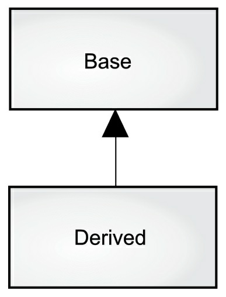
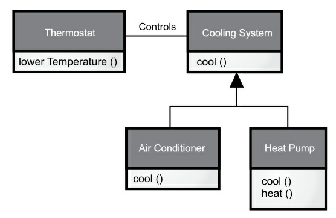

# 第一章 对象的概念

面向对象编程（Object-Oriented Programming OOP）是一种编程思维方式和编码架构。

## 抽象

所有编程语言都提供抽象机制。从某种程度上来说，问题的复杂度直接取决于抽象的东西和质量。汇编语言是对底层机器的轻微抽象。接着出现的“命令式”语言（如 FORTRAN，BASIC 和 C）是对汇编语言的抽象。

为机器建模的另一个方法是为要解决的问题制作模型。但是模型只适合解决某一类的问题。

面向对象的程序设计在此基础上跨出了一大步，这种表达非常具有普遍性，不必受限于特定类型的问题。

Smalltalk 中面向对象的成功影响了 Java 语言 ，*Alan Kay* 总结了面向对象的五大基本特征。

> 1. **万物皆对象**。
> 2. **程序是一组对象，对象之间通过方法来交互**。
> 3. **通过封装现有对象，可制作出新型对象**。
> 4. **每个对象都属于一个类**。
> 5. **同一个类的实例有相同的行为**。

*Grady Booch* 的描述更简单：一个对象具有自己的状态，行为和标识。这意味着对象有自己的内部数据(提供状态)、方法 (产生行为)，并彼此区分（每个对象在内存中都有唯一的地址）。

## 接口

在面向对象的程序设计中，尽管我们真正要做的是新建各种各样的数据“类型”（Type），但几乎所有面向对象的程序设计语言都采用了 `class` 关键字。当你看到 “type” 这个词的时候，请同时想到 `class`；反之亦然。

创建好一个类后，可根据情况生成许多对象。随后，可将那些对象作为要解决问题中存在的元素进行处理。

那么如何利用对象完成真正有用的工作呢？必须有一种办法能向对象发出请求，令其解决一些实际的问题，比如在屏幕上画一些东西或者打开一个开关等等。每个对象能接受的请求是不同的。对象能接受的请求用接口（Interface）定义，对象的“类型”则决定了它的接口有什么。

下面让我们以电灯泡为例：


```java
Light lt = new Light();
lt.on();
```

在这个例子中，类名称是 **Light**，可向 **Light** 对象发出的请求包括打开 `on`、关闭 `off`、变得更明亮 `brighten` 或者变得更暗淡 `dim`。

为了向对象发送消息，我们使用句点符号 `.` 将 `lt` 和消息名称 `on` 连接起来。

上图遵循 **UML**（Unified Modeling Language，统一建模语言）的格式。每个类由一个框表示，框的顶部有类型名称，框中间部分是要描述的属性，底部是方法。通常，只有类的名称和公共方法在 **UML** 设计图中显示，因此中间部分未显示，如本例所示。如果你只对类名感兴趣，则也不需要显示方法信息。

## 服务提供

在开发或理解程序设计时，我们可以将对象看成是“服务提供者”。

软件设计的基本原则是高内聚：每个组件的内部作用明确，功能紧密相关。每个对象都提供了一组紧密的服务。在良好的面向对象设计中，每个对象功能单一且高效。这样的程序设计可以提高我们代码的复用性，同时也方便别人阅读和理解我们的代码。只有让人知道你提供什么服务，别人才能更好地将其应用到其他模块或程序中。

## 封装

我们可以把编程分为研发和应用。应用程序员调用研发程序员构建的基础工具类来做快速开发。研发程序员开发工具类，向应用程序员公开必要的内容，并隐藏内部实现的细节。这样可以有效地避免该工具类被错误的使用和更改，从而减少程序出错的可能。彼此职责划分清晰，相互协作。当应用程序员调用研发程序员开发的工具类时，双方建立了关系。应用程序员通过使用现成的工具类组装应用程序或者构建更大的工具库。如果工具类的创建者将类的内部所有信息都公开给调用者，那么有些使用规则就不容易被遵守。因为前者无法保证后者是否会按照正确的规则来使用，甚至是改变该工具类。只有设定访问控制，才能从根本上阻止这种情况的发生。

因此，使用访问控制的原因有以下两点：

1. 让应用程序员不要触摸他们不应该触摸的部分。      

2. 使类库的创建者（研发程序员）在不影响后者使用的情况下完善更新工具库。例如，我们开发了一个功能简单的工具类，后来发现可以优化执行速度。假如工具类的接口和实现部分明确分开并受到保护，那我们就可以轻松地完成改造。

Java 有三个显式关键字来设置类中的访问权限：`public`（公开），`private`(私有)和`protected`（受保护）。这些访问修饰符决定了谁能访问它们修饰的方法、变量或类。

 1. `public`（公开）表示任何人都可以访问和使用；

 2. `private`（私有）除了类本身和类内部的方法，外界无法直接访问该元素。`private` 是类和调用者之间的屏障。任何试图访问私有成员的行为都会报编译时错误；

 3. `protected`（受保护）类似于 `private`，区别是子类（下一节就会引入继承的概念）可以访问 `protected` 的成员，但不能访问 `private` 成员；

 4. `default`（默认）如果你不使用前面的三者，默认就是 `default` 访问权限。`default` 被称为包访问，因为该权限下的资源可以被同一包（库组件）中其他类的成员访问。

## 复用

代码和设计方案的复用性是面向对象程序设计的优点之一。我们可以通过重复使用某个类的对象来达到这种复用性。同时，我们也可以将一个类的对象作为另一个类的成员变量使用。新的类可以是由任意数量和任意类型的其他对象构成。这里涉及到“组合”和“聚合”的概念：

* **组合**（Composition）经常用来表示“拥有”关系。例如，“汽车拥有引擎”。

* **聚合**（Aggregation）动态的**组合**。


上图中实心三角形指向“ **Car** ”表示 **组合** 的关系；如果是 **聚合** 关系，可以使用空心三角形。

（**译者注**：组合和聚合都属于关联关系的一种，需要根据实际的业务需求来判断。聚合关系中，整件不会拥有部件的生命周期，所以整件删除时，部件不会被删除。再者，多个整件可以共享同一个部件。组合关系中，整件拥有部件的生命周期，所以整件删除时，部件一定会跟着删除。而且，多个整件不可以同时共享同一个部件。这个区别可以用来区分某个关联关系到底是组合还是聚合。两个类生命周期不同步，则是聚合关系，生命周期同步就是组合关系。）

## 继承

在创建了一个类之后，即使另一个新类与其具有相似的功能，你还是得重新创建一个新类。但我们若能“克隆”现成的数据，再根据情况进行添加和修改，情况就显得理想多了。“继承”正是针对这个目标而设计的。但继承并不完全等价于克隆。在继承过程中，若基类发生了变化，子类也会反映出这种变化。



这个图中的箭头从子类指向基类。两种类型可以具有共同的特征和行为，但是一种类型可能包含比另一种类型更多的特征。继承通过基类和子类的概念来表达这种相似性。基类包含派生自它的类型之间共享的所有特征和行为。


例如，垃圾回收机对垃圾进行分类。基类是“垃圾”。每块垃圾都有重量、价值等特性，它们可以被切碎、熔化或分解。在此基础上，可以通过添加额外的特性(瓶子有颜色，钢罐有磁性)或行为(铝罐可以被压碎)派生出更具体的垃圾类型。此外，一些行为可以不同（垃圾的价格取决于它的类型和状态）。使用继承，你将构建一个类型层次结构，来表示你试图解决的某种类型的问题。第二个例子是常见的“形状”例子，基类是“形状”，每个形状都有大小、颜色、位置等等。每个形状可以绘制、擦除、移动、着色等。由此，可以派生出（继承出）具体类型的形状——圆形、正方形、三角形等等——每个形状可以具有附加的特征和行为。


从现有类型继承创建新类型。这种新类型不仅包含现有类型的所有成员（尽管私有成员被隐藏起来并且不可访问），而且更重要的是它复制了基类的接口。也就是说，基类对象接收的所有消息也能被派生类对象接收。根据类接收的消息，我们知道类的类型，因此派生类与基类是相同的类型。

在前面的例子中，“圆是形状”。这种通过继承的类型等价性是理解面向对象编程含义的基本门槛之一。因为基类和派生类都具有相同的基本接口，所以伴随此接口的必定有某些具体实现。如果继承一个类而不做其他任何事，则来自基类接口的方法直接进入派生类。这意味着派生类和基类不仅具有相同的类型，而且具有相同的行为，这么做没什么特别意义。

有两种方法可以区分新的派生类与原始的基类。第一种方法是在派生类中添加新方法。这些新方法不是基类接口的一部分。

第二种区分派生类和基类的方法是改变现有基类方法的行为，这被称为覆盖 (overriding)。要想覆盖一个方法，只需要在派生类中重新定义这个方法即可。

### "是一个"与"像是一个"的关系

继承应该只覆盖基类的方法吗？如果这样的话，基类和派生类就是相同的类型了，因为它们具有相同的接口。这会造成，你可以用一个派生类对象完全替代基类对象，也经常被称作"替代原则"。我们经常把这种基类和派生类的关系称为是一个（is-a）关系，因为可以说"圆是一个形状"。判断是否继承，就看在你的类之间有无这种 is-a 关系。

有时你在派生类添加了新的接口元素，从而扩展接口。虽然新类型仍然可以替代基类，但是这种替代不完美，原因在于基类无法访问新添加的方法。这种关系称为像是一个(is-like-a)关系。新类型不但拥有旧类型的接口，而且包含其他方法，所以不能说新旧类型完全相同。



以空调为例，假设房间里已经安装好了制冷设备的接口。想象一下，现在空调坏了，你重新安装了一个既制冷又制热的热力泵。热力泵就像是一个（is-like-a）空调，但它可以做更多。因为当初房间的控制系统被设计成只能制冷，所以它只能与新对象(热力泵)的制冷部分通信。新对象的接口已经扩展了，现有控制系统却只知道原来的接口，一旦看到这个设计，你就会发现，作为基类的制冷系统不够一般化，应该被重新命名为"温度控制系统"，也应该包含制热功能。

当你看到替代原则时，很容易会认为纯粹替代是唯一可行的方式，并且使用纯粹替代的设计是很好的。但有些时候，你会发现必须得在派生(扩展)类中添加新方法(提供新的接口)。只要仔细审视，你可以很明显地区分两种设计方式的使用场合。

## 多态

我们在处理类的层次结构时，通常把一个对象看成是它所属的基类，而不是把它当成具体类。通过这种方式，我们可以编写出不局限于特定类型的代码。在上个“形状”的例子中，“方法”（method）操纵的是通用“形状”，而不关心它们是“圆”、“正方形”、“三角形”还是某种尚未定义的形状。所有的形状都可以被绘制、擦除和移动，因此“方法”向其中的任何代表“形状”的对象发送消息都不必担心对象如何处理信息。

这样的代码不会受添加的新类型影响，并且添加新类型是扩展面向对象程序以处理新情况的常用方法。 例如，你可以通过通用的“形状”基类派生出新的“五角形”形状的子类，而不需要修改通用"形状"基类的方法。通过派生新的子类来扩展设计的这种能力是封装变化的基本方法之一。

这种能力改善了我们的设计，且减少了软件的维护代价。如果我们把派生的对象类型统一看成是它本身的基类，编译器（compiler）在编译时期就无法准确地知道什么“形状”被擦除。这就是关键所在：当程序接收这种消息时，程序员并不想知道哪段代码会被执行。“绘图”的方法可以平等地应用到每种可能的“形状”上，形状会依据自身的具体类型执行恰当的代码。

如果不需要知道执行了哪部分代码，那我们就能添加一个新的不同执行方式的子类而不需要更改调用它的方法。那么编译器在不确定该执行哪部分代码时是怎么做的呢？举个例子，下图的 **BirdController** 对象和通用 **Bird** 对象中，**BirdController** 不知道 **Bird** 的确切类型却还能一起工作。从 **BirdController** 的角度来看，这是很方便的，因为它不需要编写特别的代码来确定 **Bird** 对象的确切类型或行为。那么，在调用 **move()** 方法时是如何保证发生正确的行为（鹅走路、飞或游泳、企鹅走路或游泳）的呢？


这个问题的答案，是面向对象程序设计的妙诀：在传统意义上，编译器不能进行函数调用。由非 OOP 编译器产生的函数调用会引起所谓的**早期绑定**。这意味着编译器生成对特定函数名的调用，该调用会被解析为将执行的代码的绝对地址。

通过继承，程序直到运行时才能确定代码的地址，因此发送消息给对象时，还需要其他一些方案。为了解决这个问题，面向对象语言使用**后期绑定**的概念。当向对象调用方法时，被调用的代码直到运行时才确定。编译器确保方法存在，并对参数和返回值执行类型检查，但是它不知道要执行的确切代码。

为了执行后期绑定，Java 使用一个特殊的代码位来代替绝对调用。这段代码使用对象中存储的信息来计算方法主体的地址。因此，每个对象的行为根据特定代码位的内容而不同。当你向对象发送消息时，对象知道该如何处理这条消息。在某些语言中，必须显式地授予方法后期绑定属性的灵活性。例如，C++ 使用 **virtual** 关键字。在这些语言中，默认情况下方法不是动态绑定的。在 Java 中，动态绑定是默认行为，不需要额外的关键字来实现多态性。

为了演示多态性，我们编写了一段代码，它忽略了类型的具体细节，只与基类对话。该代码与具体类型信息分离，因此更易于编写和理解。而且，如果通过继承添加了一个新类型（例如，一个六边形），那么代码对于新类型的 Shape 就像对现有类型一样有效。

代码示例：

```java
void doSomething(Shape shape) {
    shape.erase();
    // ...
    shape.draw();
}
```

此方法与任何 **Shape** 对话，因此它与所绘制和擦除的对象的具体类型无关。如果程序的其他部分使用 `doSomething()` 方法：

```java
    Circle circle = new Circle();
    Triangle triangle = new Triangle();
    Line line = new Line();
    doSomething(circle);
    doSomething(triangle);
    doSomething(line);

```

可以看到无论传入的“形状”是什么，程序都正确的执行了。


这是一个非常令人惊奇的编程技巧。分析下面这行代码：

```java
    doSomething(circle);
```

当预期接收 **Shape** 的方法被传入了 **Circle**，会发生什么。由于 **Circle** 也是一种 **Shape**，所以 `doSomething(circle)` 能正确地执行。也就是说，`doSomething()` 能接收任意发送给 **Shape** 的消息。这是完全安全和合乎逻辑的事情。

这种把子类当成其基类来处理的过程叫做“向上转型”（**upcasting**）。在面向对象的编程里，经常利用这种方法来给程序解耦。再看下面的 `doSomething()` 代码示例：

```java
    shape.erase();
    // ...
    shape.draw();
```

我们可以看到程序并未这样表达：“如果你是一个 Circle ，就这样做；如果你是一个 Square，就那样做...”。若那样编写代码，就需检查 Shape 所有可能的类型，如圆、矩形等等。这显然是非常麻烦的，而且每次添加了一种新的 Shape 类型后，都要相应地进行修改。在这里，我们只需说：“你是一种几何形状，我知道你能删掉 `erase()` 和绘制 `draw()`，你自己去做吧，注意细节。”

我们知道，为 Circle 调用`draw()` 时执行的代码与为一个 Square 或 Line 调用 `draw()` 时执行的代码是不同的。但在将 `draw()` 信息发给一个匿名 Shape 时，根据 Shape 句柄当时连接的实际类型，会相应地采取正确的操作。这非常神奇，因为当 Java 编译器为 `doSomething()` 编译代码时，它并不知道自己要操作的准确类型是什么。

尽管我们确实可以保证最终会为 Shape 调用 `erase()` 和 `draw()`，但并不能确定特定的 Circle，Square 或者 Line 调用什么。最后，程序执行的操作却依然是正确的，这是怎么做到的呢？

发送消息给对象时，如果程序不知道接收的具体类型是什么，但最终执行是正确的，这就是对象的“多态性”（Polymorphism）。面向对象的程序设计语言是通过“动态绑定”的方式来实现对象的多态性的。编译器和运行时系统会负责对所有细节的控制；我们只需知道要做什么，以及如何利用多态性来更好地设计程序。

## 单继承结构

自从 C++ 引入以来，一个 OOP 问题变得尤为突出：是否所有的类都应该默认从一个基类继承呢？这个答案在 Java 中是肯定的（实际上，除 C++ 以外的几乎所有OOP语言中也是这样）。在 Java 中，这个最终基类的名字就是 `Object`。

Java 的单继承结构有很多好处。由于所有对象都具有一个公共接口，因此它们最终都属于同一个基类。相反的，对于 C++ 所使用的多继承的方案则是不保证所有的对象都属于同一个基类，这样可能导致新的类库和不兼容的接口。为了整合它们而花费大气力（有可能还要用上多继承）以获得 C++ 样的“灵活性”值得吗？如果从零开始，Java 这样的替代方案会是更好的选择。

另外，单继承的结构使得垃圾收集器的实现更为容易。

由于运行期的类型信息会存在于所有对象中，所以我们永远不会遇到判断不了对象类型的情况。这对于系统级操作尤其重要，例如[异常处理](#异常处理)。同时，这也让我们的编程具有更大的灵活性。

## 集合

通常，我们并不知道解决某个问题需要的对象数量和持续时间，以及对象的存储方式。那么我们如何知悉程序在运行时需要分配多少内存空间呢？

在面向对象的设计中，解决方案有些轻率：创建一个新类型的对象来引用、容纳其他的对象。当然，我们也可以使用多数编程语言都支持的“数组”。在 Java 中“集合”（Collection）的使用率更高。（也称为“容器”）

“集合”这种类型的对象可以存储任意类型、数量的其他对象。它能根据需要自动扩容，我们不用关心过程是如何实现的。

还好，一般优秀的 OOP 语言都会将“集合”作为基础包。Java 的标准库中也提供许多现成的集合类。

在一些库中，一两个泛型集合就能满足我们所有的需求了，而在其他一些类库（Java）中，不同类型的集合对应不同的需求：常见的有 List，常用于保存序列；Map，也称为关联数组，常用于将对象与其他对象关联）；Set，只能保存非重复的值；其他还包括如队列（Queue）、树（Tree）、栈（Stack）、堆（Heap）等等。从设计的角度来看，我们真正想要的是一个能够解决某个问题的集合。如果一种集合就满足所有需求，那么我们就不需要剩下的了。之所以选择集合有以下两个原因：

1. 集合可以提供不同类型的接口和外部行为。堆栈、队列的应用场景和集合、列表不同，它们中的一种提供的解决方案可能比其他灵活得多。

2. 不同的集合对某些操作有不同的效率。例如，List 的两种基本类型：ArrayList 和 LinkedList。虽然两者具有相同接口和外部行为，但是在某些操作中它们的效率差别很大。在 ArrayList 中随机查找元素是很高效的，而 LinkedList 随机查找效率低下。反之，在 LinkedList 中插入元素的效率要比在 ArrayList 中高。由于底层数据结构的不同，每种集合类型在执行相同的操作时会表现出效率上的差异。

我们可以一开始使用 LinkedList 构建程序，在优化系统性能时改用 ArrayList。通过对 List 接口的抽象，我们可以很容易地将 LinkedList 改为 ArrayList。

在 Java 5 泛型出来之前，集合中保存的是通用类型 `Object`。Java 单继承的结构意味着所有元素都基于 `Object` 类，所以在集合中可以保存任何类型的数据，易于复用。要使用这样的集合，我们先要往集合添加元素。由于 Java 5 版本前的集合只保存 `Object`，当我们往集合中添加元素时，元素便向上转型成了 `Object`，从而丢失自己原有的类型特性。这时我们再从集合中取出该元素时，元素的类型变成了 `Object`。那么我们该怎么将其转回原先具体的类型呢？这里，我们使用了强制类型转换将其转为更具体的类型，这个过程称为对象的“向下转型”。通过“向上转型”，我们知道“圆形”也是一种“形状”，这个过程是安全的。可是我们不能从“Object”看出其就是“圆形”或“形状”，所以除非我们能确定元素的具体类型信息，否则“向下转型”就是不安全的。也不能说这样的错误就是完全危险的，因为一旦我们转化了错误的类型，程序就会运行出错，抛出“运行时异常”（RuntimeException）。（后面的章节会提到） 无论如何，我们要寻找一种在取出集合元素时确定其具体类型的方法。另外，每次取出元素都要做额外的“向下转型”对程序和程序员都是一种开销。以某种方式创建集合，以确认保存元素的具体类型，减少集合元素“向下转型”的开销和可能出现的错误难道不好吗？这种解决方案就是：参数化类型机制（Parameterized Type Mechanism）。

参数化类型机制可以使得编译器能够自动识别某个 `class` 的具体类型并正确地执行。举个例子，对集合的参数化类型机制可以让集合仅接受“形状”这种类型的元素，并以“形状”类型取出元素。Java 5 版本支持了参数化类型机制，称之为“泛型”（Generic）。泛型是 Java 5 的主要特性之一。你可以按以下方式向 ArrayList 中添加 Shape（形状）：

```java
    ArrayList<Shape> shapes = new ArrayList<>();
```

## 对象创建与生命周期

在使用对象时要注意的一个问题就是对象的创建和销毁。每个对象的生存都需要资源，尤其是内存。为了资源的重复利用，当对象不再被使用时，我们应该及时释放资源，清理内存。

在简单的编程场景下，对象的清理并不是问题。我们创建对象，按需使用，最后销毁它。然而，情况往往要比这更复杂：

假设，我们正在为机场设计一个空中交通管制的系统。第一步比较简单：创建一个用来保存飞机的集合，每当有飞机进入交通管制区域时，我们就创建一个飞机对象加入到集合中，等到飞机离开时将其从集合中清除。与此同时，我们还需要一个记录飞机信息的系统。比如，我们要记录所有飞机中的小型飞机的的信息。此时，我们又创建了第二个集合来记录所有小型飞机。 每当创建一个“飞机”对象的时候，将其放入第一个集合；若它属于小型飞机，也必须同时将其放入第二个集合里。

现在问题开始棘手了：我们怎么知道何时该清理这些对象呢？当某一个系统处理完成，而其他系统可能还没有处理完成。这样的问题在其他的场景下也可能发生。在 C++ 程序设计中，当使用完一个对象后，必须明确将其删除，这就让问题变复杂了。

对象的数据在哪？它的生命周期是怎么被控制的？ 在 C++ 设计中采用的观点是效率第一，因此它将选择权交给了程序员。为了获得最大的运行时速度，程序员可以在编写程序时，通过将对象放在栈（Stack，有时称为自动变量或作用域变量）或静态存储区域（static storage area）中来确定内存占用和生存时间。这些区域的对象会被优先分配内存和释放。这种控制在某些情况下非常有用。

然而相对也牺牲了程序的灵活性。因为在编写代码时，我们必须要弄清楚对象的数量、生存时间、类型。如果我们要用它来解决普遍的问题时，限制就太大了。

第二种方法是在堆内存（Heap）中动态地创建对象。在这种方式下，直到程序运行我们才能确定需要创建的对象数量、生存时间和类型。什么时候需要，什么时候在堆内存中创建。 因为内存的占用是动态管理的，所以在运行时，在堆内存上开辟空间所需的时间可能比在栈内存上要长（但也不一定）。在栈内存开辟和释放空间通常是一条将栈指针向下移动和一条将栈指针向上移动的汇编指令。开辟堆内存空间的时间取决于内存机制的设计。

动态方法有一个逻辑假设：对象趋向于变得复杂，因此额外的内存查找和释放对对象的创建影响不大。此外，更好的灵活性对于问题的解决至关重要。

Java 使用动态内存分配。每次创建对象时，使用 `new` 关键字构建该对象的动态实例。这又带来另一个问题：对象的生命周期。较之堆内存，在栈内存中创建对象，编译器能够确定该对象的生命周期并自动销毁它；然而如果你在堆内存创建对象的话，编译器是不知道它的生命周期的。Java 的内存管理是建立在垃圾收集器上的，它能自动发现对象不再被使用并释放内存。垃圾收集器的存在带来了极大的便利，它减少了我们之前必须要跟踪的问题和编写相关代码的数量。

Java 的垃圾收集器被设计用来解决内存释放的问题。垃圾收集器知道对象什么时候不再被使用并且自动释放内存。

## 异常处理

异常处理机制将程序错误直接交给编程语言甚至是操作系统。“异常”（Exception）是一个从出错点“抛出”（thrown）后能被特定类型的异常处理程序捕获(catch)的一个对象。它不会干扰程序的正常运行，仅当程序出错的时候才被执行。这让我们的编码更简单：不用再反复检查错误了。

最后，“异常机制”提供了一种可靠地从错误状况中恢复的方法，使得我们可以编写出更健壮的程序。有时你只要处理好抛出的异常情况并恢复程序的运行即可，无需退出。

如果没有编写适当的异常处理代码，你将会收到一条编译时错误消息。这种有保障的一致性有时会让程序的错误处理变得更容易。

## 本章小结

面向过程程序包含数据定义和函数调用。要找到程序的意图，你必须要在脑中建立一个模型，弄清函数调用和更底层的概念。

